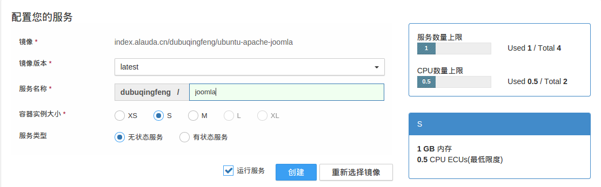
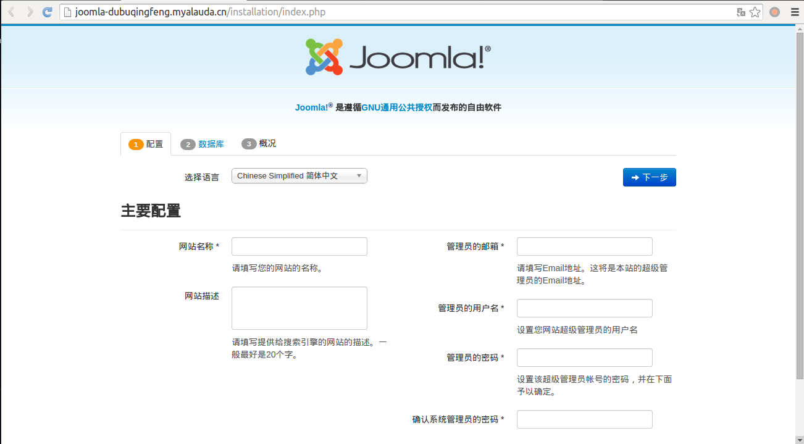
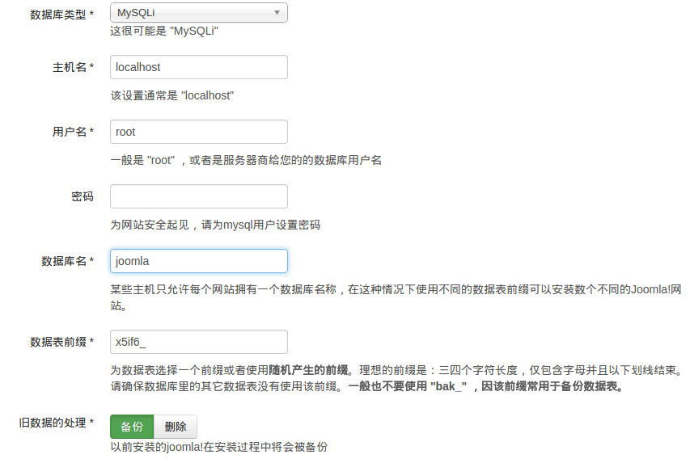
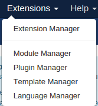
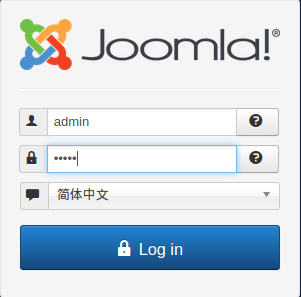

#Joomla的Docker镜像
---
为了joomla的基础部署的docker镜像，可根据dockerfile自行修改。展示页面在[alauda](http://joomla-dubuqingfeng.myalauda.cn/)，后台登录地址：http://joomla-dubuqingfeng.myalauda.cn/administrator/，用户名admin，密码admin。

##0x01 Docker简单介绍
###利用Docker的场景.
1.在传统开发及测试当中，开发需要和测试进行一定的沟通，从而争取开发环境与测试环境的统一，但不能保证完全相同，以及还有服务器生产环境。版本配置等的不同,导致了一些部署上的问题。利用Docker，开发部门只需打包好镜像，测试及运维部门通过Docker快速部署，可以规定一些基础服务的版本等，只需要几分钟可以配置好测试及运维环境。
2.沙箱可以实现轻型隔离，多个容器间不会相互影响。
3.大规模集群部署。
4.Docker可以自动化打包和部署任何应用，方便地创建一个轻量级私有PaaS云。
###能用Docker做什么？
集群测试环境、大规模Web部署、数据库集群、持续部署系统、私有PaaS技术，面向服务的体系结构……

+ Docker可以应用在一些[集群部署](http://www.infoq.com/cn/articles/tencent-millions-scale-docker-application-practice)的场景，方便地构建[集群](http://www.infoq.com/cn/articles/large-scale-docker-cluster-practise-experience-share)架构。
+ [私有PaaS技术](http://qing.blog.sina.com.cn/2294942122/88ca09aa33003ydp.html)
+ 而对于一些中小型的创业企业或者互联网公司的开发者来说，一个稳定的[测试环境](http://www.xiaomastack.com/2015/04/05/docker-dev-test-deploy/)是重要的，尤其是开发部门和测试、运维部门的配合方面，开发部门只需维护一个[Dockerfile](https://docs.docker.com/reference/builder/)，可以统一开发环境并减低运维团队负担。

###Docker如何方便地入门？
+ [Docker入门与实践](https://www.gitbook.com/book/yeasy/docker_practice/details)
+ [Docker入门实战](http://yuedu.baidu.com/ebook/d817967416fc700abb68fca1)
+ [官方文档](https://docs.docker.com/)
+ [第一本Docker书](http://product.dangdang.com/23623098.html)
+ Docker几个概念要了解，镜像、容器、仓库
+ [「开发工具，开发模式」Docker 入门教程](http://www.html-js.com/qa/Docker-tutorial)

##0x02 如何部署本镜像
###版本说明

依照最新版[joomla](https://github.com/joomla/joomla-cms)构建。

###在灵雀云上的部署

1.进入镜像社区（登录后的顶部导航栏部分）

2.选择镜像，搜索joomla，点击那个[ubuntu-apache-joomla镜像](https://hub.alauda.cn/repos/dubuqingfeng/ubuntu-apache-joomla),点击创建服务。

3.输入服务名称，例joomla，如图所示。

4.稍等片刻，等服务开始运行后，打开网址。如图所示。

5.填写数据库表单，用户名填root，密码为空，数据库名为joomla。如图所示。

6.进入下一步，开始安装。

7.安装完毕后，可以通过之前设定的密码登入后台。

8.后台增加语言，在顶部导航栏里点击[Language Manager]。如图所示。

9.点击[Install Language]，选择中文简体（Chinese Simplified），点击[Install]

10.重新登录时，可选择语言，如图所示。

###在vps上的部署说明
1.安装并测试Docker，可以参考[官方文档](https://docs.docker.com/installation/ubuntulinux/)。或者是《Docker入门与实践》[安装](http://yeasy.gitbooks.io/docker_practice/content/install/index.html)一节。

2.通过拉取镜像，配置服务。

	sudo docker pull index.alauda.cn/dubuqingfeng/ubuntu-apache-joomla

3.运行容器

	sudo docker run -t -p 80:80 -p 3306:3306 index.alauda.cn/dubuqingfeng/ubuntu-apache-joomla 

4.删除容器

	sudo docker rm 容器id
    
    如何得到容器id，可用docker ps -a

5.删除镜像

可以使用 `docker rmi `命令。注意 `docker rm `命令是移除容器。

	sudo docker rmi index.alauda.cn/dubuqingfeng/ubuntu-apache-joomla

**注意**：在删除镜像之前要先用 `docker rm `删掉依赖于这个镜像的所有容器。

##0x03 打包镜像
####在此镜像基础上如何进一步打包镜像？

1.根据本镜像的Dockerfile，维护自己的Dockerfile。参考官方文档的[Dockerfile一节]()。

2.拉取本镜像，提交到自己的仓库里。

##0x04 反馈
###提交反馈
如有问题及建议，请提交issue到[Github](https://github.com/dubuqingfeng/Docker-Web-Images)。或者发送email到1135326346@qq.com。
###协议

###更新记录
v1.0.0

+ 建立Dockerfile并测试
